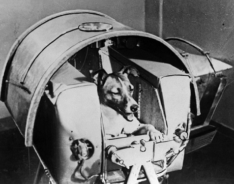
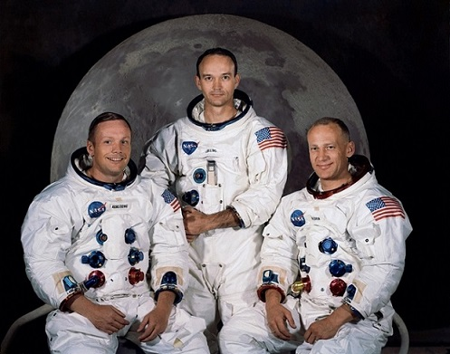

```{r setup, include=FALSE}
knitr::opts_chunk$set(warning = FALSE,
                      message = FALSE,
                      echo = FALSE,
                      comment="")
```

```{r}
library(tidyverse)
library(plotly)
library(DT)
library(mosaic)
library(ggmosaic)
```

## The first space launch occurred October 4, 1957. What was its name and who launched it?


## One month later, on November 3, 1957, the first living being was launched into space. What was the name of this first cosmonaut?



## It took four more years (and over 30 cosmo-dogs) before the first human was launched into space on April 12, 1961.


## And then another eight years for humans to set foot on our Moon on July 20, 1969. 



## Project Goal

-   Determine the relationship between Space Mission Success and other variables


## Data

```{r}
space <- read.csv("https://raw.githubusercontent.com/qntkhvn/regression_project/main/spacemission.csv")
```

```{r}
sp <- space[,3:ncol(space)] %>% 
  separate(Datum, into = c("Weekday", "Month", "Day", "Year")) %>% 
  mutate(Active = as.factor(ifelse(Status.Rocket == "StatusActive", "Yes", "No")),
         Success = as.factor(ifelse(Status.Mission == "Success", "Yes", "No"))) %>% 
  rename(Company = Company.Name)

datatable(sp %>% 
    select(Company, Location, Detail, Month, Day, Year, Active, Success) %>% 
    arrange(Year),
  options = list(pageLength = 5))
```

<br>

Source: <https://www.kaggle.com/agirlcoding/all-space-missions-from-1957>

## EDA

```{r}
yrcount <- sp %>% 
  group_by(Year) %>% 
  summarise(count = n())
```

```{r}
plot_ly(yrcount, 
        x = ~Year, 
        y = ~count, 
        type = 'scatter', 
        mode = 'lines', 
        fill = 'tozeroy',
        fillcolor = "darkkhaki") %>%
  layout(title = 'Space Missions (1957-2020)',
         yaxis = list(title = "Yearly Count"), 
         hovermode = 'compare')
```

## EDA

```{r}
comp <- sp %>% 
  group_by(Company) %>% 
  mutate(ct = n()) %>% 
  filter(ct >= 43) %>% 
  ungroup() %>% 
  group_by(Year, Company) %>% 
  summarise(count = n())
```

```{r}
plot_ly(comp, 
        x = ~Year, 
        y = ~count, 
        type = 'scatter', 
        mode = 'lines', 
        color = ~Company,
        colors = "Paired",
        fill = 'tozeroy') %>%
  layout(title = 'Space Missons Conducted by Major Companies',
         xaxis = list(dtick = 3),
         yaxis = list(title = "Yearly Count"), 
         hovermode = 'compare') 
```

## Method

-   Categorical Data Analysis with **Logistic Regression** $$\displaystyle logit(\pi) = log \left( \frac{\pi}{1- \pi} \right) = \beta_0 + \beta_1 X_{1} + \beta_2 X_{2} + \ldots + \beta_k X_{k}$$

-   **Single Logistic Regression** models $$\displaystyle logit(\pi) = log \left( \frac{\pi}{1- \pi} \right) = \beta_0 + \beta_1 X_{1}$$

    -   Response variable: Mission Outcome (Success: Yes/No)

    -   Predictors: Rocket Status (Active/Retired), Country (USA/Russia), Space Race Decade (1960s/1970s)


## Inferences

-   Hypothesis test for the slope
    -   Test whether the groups/levels in the explanatory variable differ in chance (odds) of success

<center>

$H_o:$ $\beta_1 = 0$

$H_a:$ $\beta_1 \ne 0$

Test statistic: $\displaystyle z = \frac{\hat{\beta_1}}{s(\hat{\beta_1})}$

p-value = `2*pnorm(z, lower.tail = FALSE)`

</center>

-   Confidence interval

$$\hat{\beta_1} \pm z_{({1 - \alpha/2})} s(\hat{\beta_1})$$

## Mission Status vs Rocket Status

-   Is there a difference in the chance of success between active and retired rockets?

```{r}
ct <- count(sp, Active, Success)
p <- ggplot(data = ct) +
  geom_mosaic(aes(weight = n, x = product(Active), fill = Success)) +
  xlab("Active") + ylab("Success") + ggtitle("Space Mission Status and Outcome")
ggplotly(p)
```

## Mission Status vs Rocket Status

-   Model $$logit(Pr(Success)) = 2.084 + 0.528 \cdot Active$$

```{r}
mod <- glm(Success ~ Active, family = binomial, data = sp)
summary(mod)$coef
```

-   Untransform (exponentitate) slope to get odds ratio

```{r}
c(exp(coef(mod)[2]), exp(confint(mod)[2,]))

# OR = 1.696
# active rockets have 1.696 greater odds of success than retired rockets

# we're 95% confident that active rockets have 1.273 to 2.302 times greater odds of being part of a successful mission than retired rockets
```

## USA vs Russia

-   Do the two countries have the same chance of space mission success?

```{r}
sp <- sp %>%
  mutate(ID = paste("id", 1:nrow(sp), sep = "")) %>% 
  separate(Location, into = c("str1", "str2", "str3", "str4"), sep = ", ")

usa <- sp %>% 
  filter(str4 == "USA")

rus <- sp %>% 
  filter(str3 %in% c("Russia", "Kazakhstan") | str2 == "Russia")
```

```{r}
sp <- sp %>% 
  mutate(Country = ifelse(ID %in% usa$ID, "USA",
                          ifelse(ID %in% rus$ID, "Russia", "Other")))
```

```{r}
usrus <- sp %>% 
  filter(Country %in% c("USA", "Russia"))
usrus$Country <- factor(usrus$Country, levels = c("USA", "Russia"))
```

```{r}
ct <- count(usrus, Country, Success)
p <- ggplot(data = ct) +
  geom_mosaic(aes(weight = n, x = product(Country), fill = Success)) +
  xlab("Country") + ylab("Success") + ggtitle("Space Mission Outcome for USA and Russia")
ggplotly(p)
```

## USA vs Russia

-   Model $$logit(Pr(Success)) = 2.016 + 0.319 \cdot Russia$$

```{r}
usrus_mod <- glm(Success ~ Country,
                 family = binomial(link = "logit"),
                 data = usrus)

round(coef(summary(usrus_mod)), 5)
```

-   Inferences

```{r}
OR <- exp(coef(usrus_mod)[2])
# Russia has 1.376 times greater odds (is 1.376 times more likely) of having successful space missions than USA
# In terms of probability
prob <- exp(coef(usrus_mod)[2])/(1+exp(coef(usrus_mod)[2])) # 0.579
```

```{r}
CI <- exp(confint(usrus_mod)[2,]) # (1.099, 1.722) greater odds
```

```{r}
c(OR, as.numeric(prob), CI)
```

## Space Race Decades: 1960s and 1970s

{width="555"}

## Space Race Decades: 1960s and 1970s

- Do the two decades differ in terms of successful rate of space mission?

```{r}
sprace <- sp %>% 
  filter(as.numeric(Year) %in% 1960:1979) %>% 
  mutate(Decade = ifelse(Year %in% 1960:1969, "1960s", "1970s"))

ct <- count(sprace, Decade, Success)
p <- ggplot(data = ct) +
  geom_mosaic(aes(weight = n, x = product(Decade), fill = Success)) +
  xlab("Decade") + ylab("Success") + ggtitle("1960s and 1970s Space Race Outcomes")
ggplotly(p)
```

## Space Race Decades: 1960s and 1970s

-   Model $$logit(Pr(Success)) = 1.329 + 1.211 \cdot Decade1970s$$

```{r}
dec_mod <- glm(Success ~ Decade, family = binomial, data = sprace)
```

-   Inferences

```{r}
c(exp(coef(dec_mod)[2]), exp(confint(dec_mod)[2,]))

# OR = 3.355
# 1970s: 3.355 times larger odds of successful
# (2.512, 4.519)
```

## Which model gives us best prediction?

- AIC (Akaike's Information Criterion)  

- The smaller the AIC, the better the model

```{r}
Model <- c("Rocket Status", "Country", "Decade")
AIC <- round(c(mod$aic, usrus_mod$aic, dec_mod$aic), 3)
datatable(rbind(Model, AIC), colnames = rep("", 3), options = list(dom = 't'))
```

## Summary

-   Active rockets have greater chance of success than retired rockets 

(OR = 1.696, 95% CI (1.273, 2.302))

-   Russia is more likely to have successful space missions than USA 

(OR = 1.376, 95% CI (1.099, 1.722))

-   There's an increase in success rate from 1960s to 1970s 

(OR = 3.355, 95% CI (2.512, 4.519))

## Future Work

-   Time Series Analysis
-   Mixed Models
-   Spatial Visualization

## Thanks!

-   GitHub: https://github.com/qntkhvn/regression_project
-   Good luck with Finals!

<br>

-   What were the odds in 1957 of being the exact stray dog chosen to be the first living thing in space? ~Laika million to one~